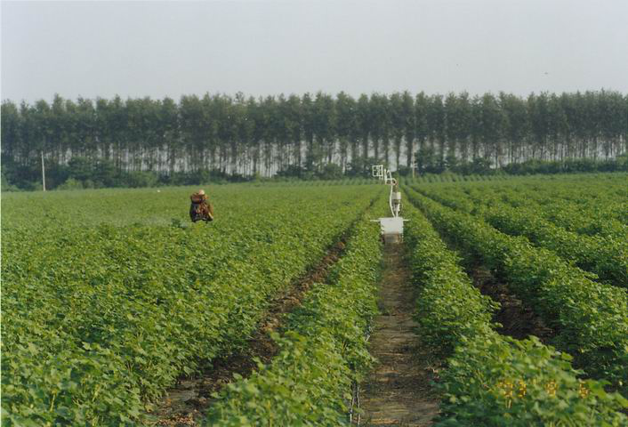
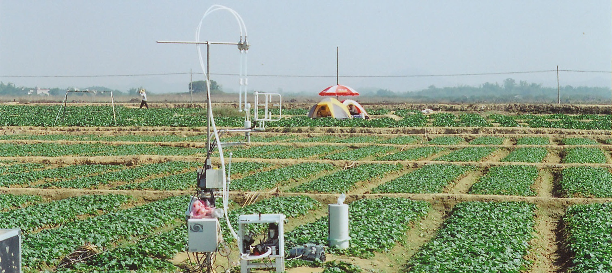
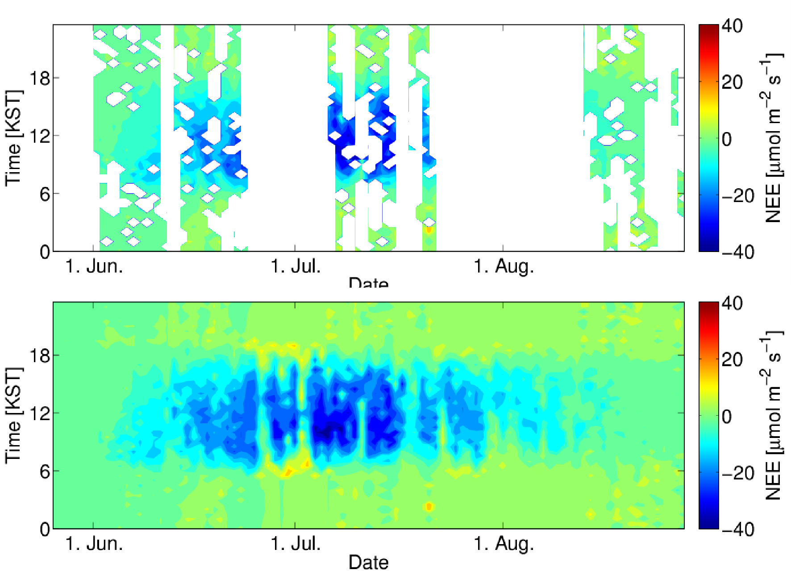
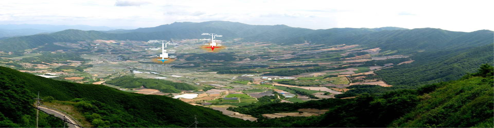
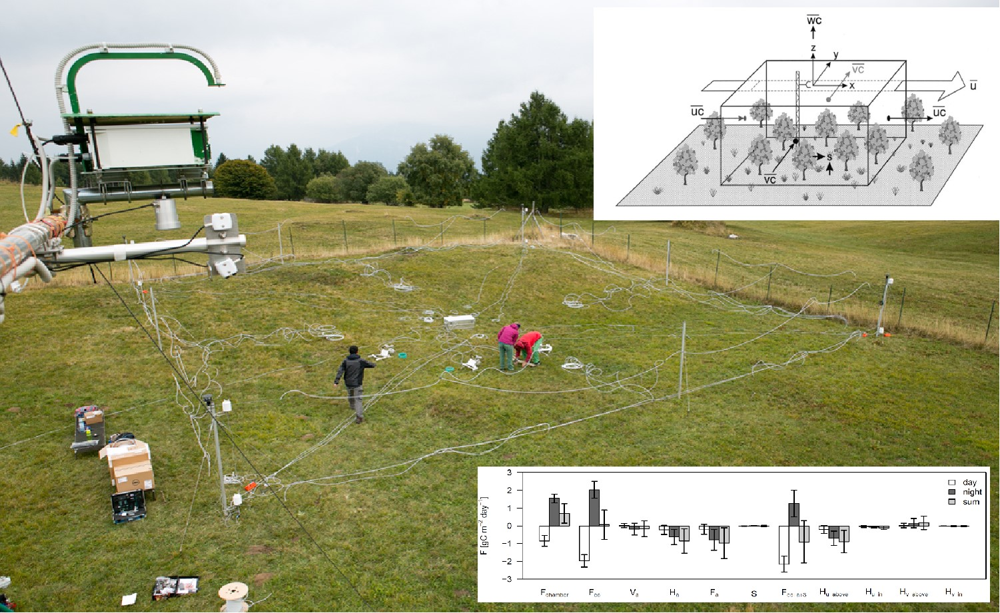

```{r setup, include=FALSE}
options(htmltools.dir.version = FALSE)
knitr::opts_chunk$set(echo = FALSE, warning = FALSE, message = FALSE) 
```

```{r, guide, include=FALSE}
# references
# library(RefManageR)
# BibOptions(check.entries = FALSE, 
#            bib.style = "authoryear", 
#            cite.style = 'alphabetic', 
#            style = "markdown",
#            hyperlink = FALSE, 
#            dashed = FALSE)
# bibfile <- 'resource/mindr.bib'
# if(!file.exists(bibfile)) beginr::bib(pkg = c('mindr', 'xaringan'), bibfile = bibfile)
# myBib <- ReadBib(bibfile, check = FALSE)
# ct <- function(bib) {
#   Cite(myBib, bib, .opts = list(cite.style = "authoryear", hyperlink =  "mindr.html#37"))
# # Citet()
# # Citep()
# # AutoCite()
# }
# # `r ct('R-mindr')`
# # ```{r, 'ref', results='asis', echo=FALSE}
# # PrintBibliography(myBib)
# # ```

# anamation
# animation <- c("bounce","shake","wobble","bounceInLeft","bounceOutDown","fadeIn","fadeInLeftBig","fadeInUpBig","fadeOutLeft","fadeOutUp","flipOutX","rotateIn","rotateInUpRight","rotateOutUpLeft","rollIn","zoomInLeft","zoomOutDown","slideInDown","slideOutDown","heartBeat","flash","headShake","jello","bounceInRight","bounceOutLeft","fadeInDown","fadeInRight","fadeOut","fadeOutLeftBig","fadeOutUpBig","flipOutY","rotateInDownLeft","rotateOut","rotateOutUpRight","rollOut","zoomInRight","zoomOutLeft","slideInLeft","slideOutLeft","pulse","swing","bounceIn","bounceInUp","bounceOutRight","fadeInDownBig","fadeInRightBig","fadeOutDown","fadeOutRight","flipInX","lightSpeedIn","rotateInDownRight","rotateOutDownLeft","hinge","zoomIn","zoomInUp","zoomOutRight","slideInRight","slideOutRight","rubberBand","tada","bounceInDown","bounceOut","bounceOutUp","fadeInLeft","fadeInUp","fadeOutDownBig","fadeOutRightBig","flipInY","lightSpeedOut","rotateInUpLeft","rotateOutDownRight","jackInTheBox","zoomInDown","zoomOut","zoomOutUp","slideInUp","slideOutUp")
# # bounceIn fadeIn retateIn slideInRight

# backgroun image
# # background-image: url(resource/x.jpg)
# # background-size: 100px
# # background-size: cover
# # background-position: 95% 5%

# class
# # class: inverse, right, bottom, animated, slideInRight

# columns
# # .pull-left[
# # ]
# # .left-column[ ]	side bar
# # .center[]

# text, pre-defined in extra.css
# # .red[&#9785;]
# # .small[unhappy...]
# # .large[happy...]
# # insert symbols: <https://www.toptal.com/designers/htmlarrows/>

# table
# # .small[the plain markdown syntax for a table]
# # <div style="font-size: tiny">` `</div>
# # .small[`knitr::kable`]

# code highlight
# # code #<<

# image
# # [](resource/*.jpg)
# # 

# footnote
# # <sup>*</sup>
# # .footnote[[*]
# # <https://xuer.pzhao.org>
# # ]

# note
# # ???


# ppt to xaringan
# devtools::install_github("datalorax/slidex")
# library(slidex)
# pptx <- system.file("examples", "slidedemo.pptx", package = "slidex")
# convert_pptx(path = pptx, author = "Daniel Anderson")

# xaringan to pdf
# install.packages("webshot")
# library(webshot)
# install_phantomjs()
# file_name <- paste0("file://", normalizePath("my_xaringan.html"))
# webshot(file_name, "mypdf.pdf")
```
# Footprints

## Postgraduate study

.pull-left[



- DDTs emissions were found after the application of dicofol.

.small[(Pan, 2004)]

]


.pull-right[



.small[(Zhao, 2005)]

- Release of ammonium in fine particles from agricultural activities

]

---

## PhD

.pull-left[

$\mathrm {CO}_2$ fluxes with gaps (upper) and gap-filled (lower)

.center[



]

]

.pull-right[

.small[(Zhao et al., 2016, 2017; Lee et al., 2016)]

]



---

## Post-doc

Advective contribution to $\mathrm{CO}_2$:



.footnote[
.small[(Zhao et al., 2018)]
]

---
class: bottom, center

## Books

```{r, echo=FALSE, out.width="25%", fig.show='hold'}
knitr::include_graphics(
  c("resource/book-blogdown.jpg",
    "resource/book-bookdown.jpg",
    "resource/book-rmarkdown.jpg",
    "resource/book-xuer.jpg")
  )
```


---
class: center, middle, inverse

# Thanks!

https://connect.xjtlu.edu.cn/user/pengzhao
