```{r setup, include=FALSE}
options(htmltools.dir.version = FALSE)
```

```{r, load_ref, echo=FALSE, cache=FALSE}
library(RefManageR)
BibOptions(check.entries = FALSE, 
           bib.style = "authoryear", 
           cite.style = 'alphabetic', 
           style = "markdown",
           hyperlink = FALSE, 
           dashed = FALSE)
bibfile <- 'bib/mindr.bib'
if(!file.exists(bibfile)) beginr::bib(pkg = c('mindr', 'xaringan'), bibfile = bibfile)
myBib <- ReadBib(bibfile, check = FALSE)
ct <- function(bib) {
  Cite(myBib, bib, .opts = list(cite.style = "authoryear", hyperlink =  "mindr.html#37"))
  }

animation <- c("bounce","shake","wobble","bounceInLeft","bounceOutDown","fadeIn","fadeInLeftBig","fadeInUpBig","fadeOutLeft","fadeOutUp","flipOutX","rotateIn","rotateInUpRight","rotateOutUpLeft","rollIn","zoomInLeft","zoomOutDown","slideInDown","slideOutDown","heartBeat","flash","headShake","jello","bounceInRight","bounceOutLeft","fadeInDown","fadeInRight","fadeOut","fadeOutLeftBig","fadeOutUpBig","flipOutY","rotateInDownLeft","rotateOut","rotateOutUpRight","rollOut","zoomInRight","zoomOutLeft","slideInLeft","slideOutLeft","pulse","swing","bounceIn","bounceInUp","bounceOutRight","fadeInDownBig","fadeInRightBig","fadeOutDown","fadeOutRight","flipInX","lightSpeedIn","rotateInDownRight","rotateOutDownLeft","hinge","zoomIn","zoomInUp","zoomOutRight","slideInRight","slideOutRight","rubberBand","tada","bounceInDown","bounceOut","bounceOutUp","fadeInLeft","fadeInUp","fadeOutDownBig","fadeOutRightBig","flipInY","lightSpeedOut","rotateInUpLeft","rotateOutDownRight","jackInTheBox","zoomInDown","zoomOut","zoomOutUp","slideInUp","slideOutUp")
```

background-image: url(img/stories.jpg)
class: inverse, right, bottom, animated, slideInRight

# Let's begin with some stories...

???
I wish my audience won't fall asleep. 

---

class: animated, fadeIn

## The story of md2mm()

### The book *Learning R* *

.pull-left[

]

--

.pull-right[
[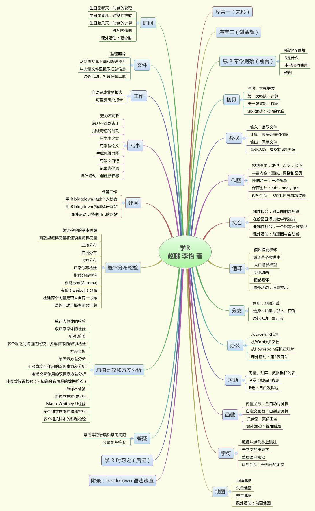](img/mindr_xuer.jpg)
]

.footnote[[*]
<https://xuer.pzhao.org>
]
---
class: animated, fadeIn

## The story of md2mm()

### The book *Learning R* 

.pull-left[
[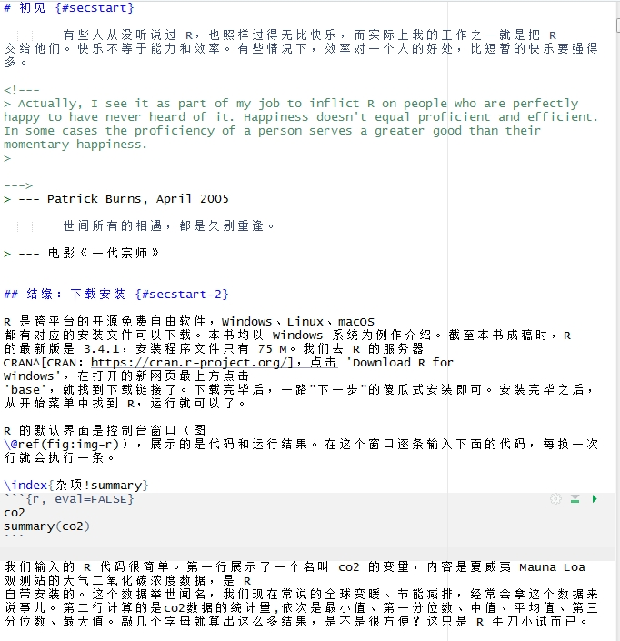](img/rmarkdown.jpg)
]
.pull-right[

]

---
class: animated, fadeIn

### Mind map tools

.pull-left[

[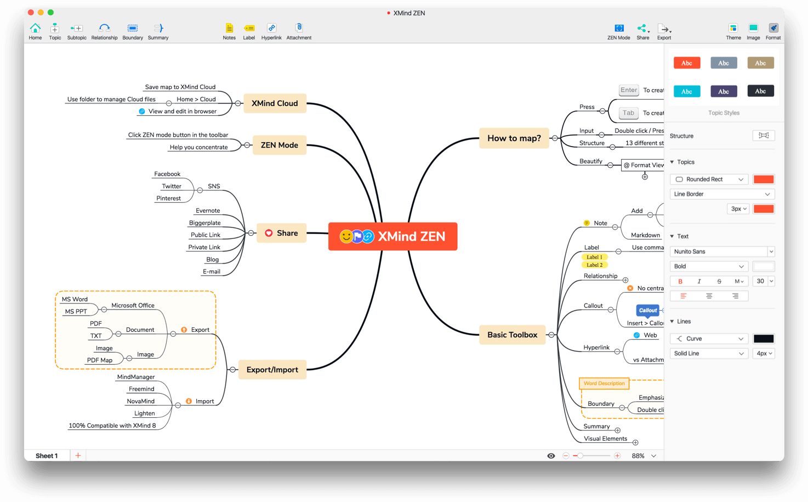](img/xmind-demo.png)
]
--
.pull-right[
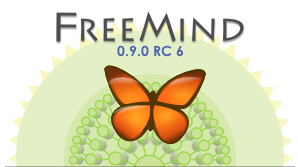
[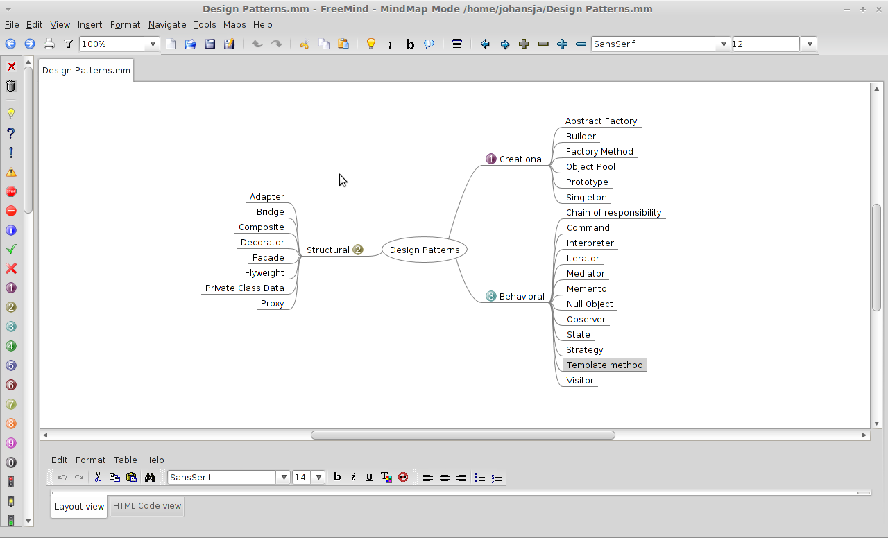](img/freemind.demo.png)
]

---
class: animated, fadeIn

### Mind map codes

.pull-left[

[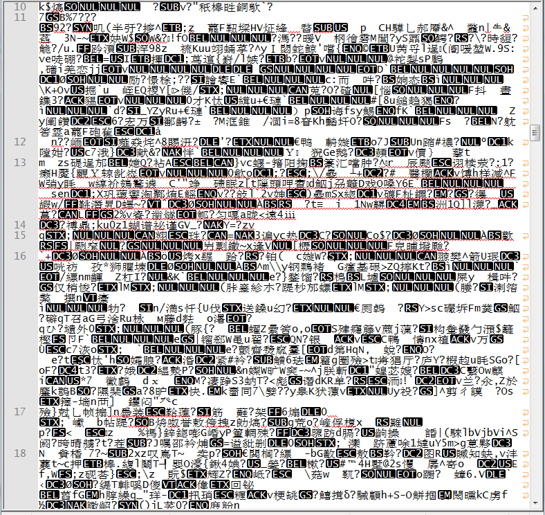](img/xmind-code.png)
]
.pull-right[

[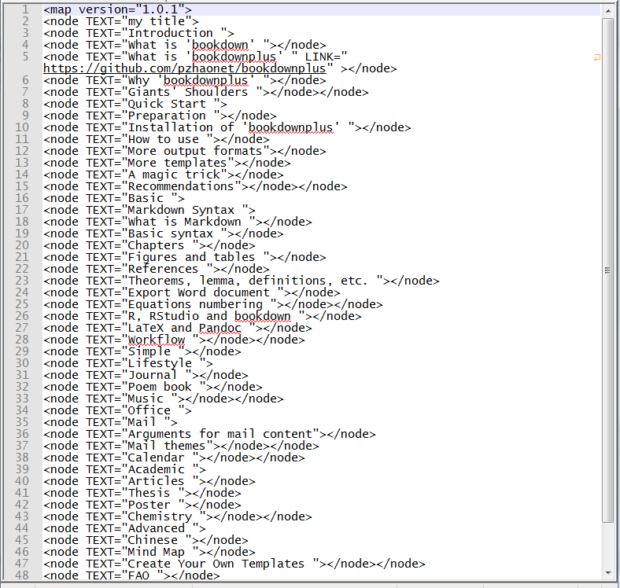](img/freemind.code.png)
]

---
class: animated, rotateIn

### when md2mm() was born

- The first function of mindr `r ct('R-mindr')` 
 
[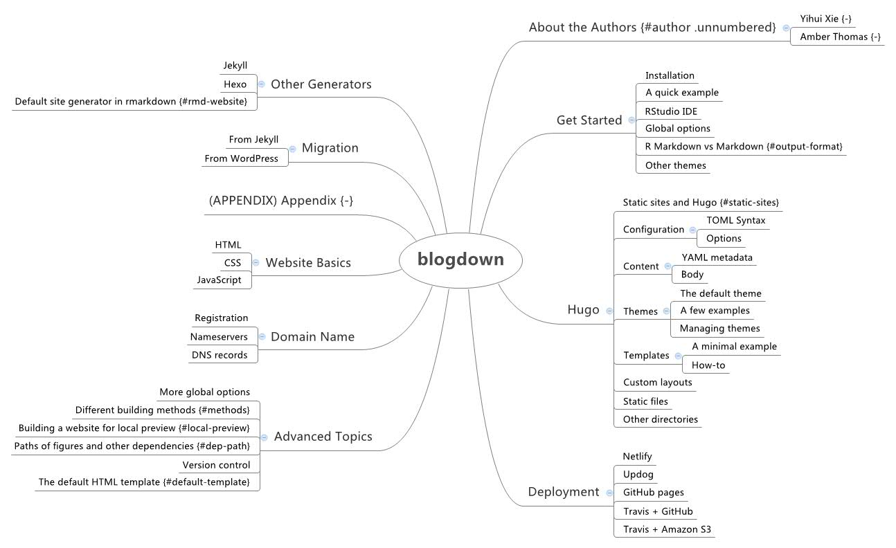](img/mindr_blogdown.jpg)

.red[&#9785;] .small[unhappy...]

---
class: animated, fadeIn

### Growing Pains (Episode 1): the bookdown style

[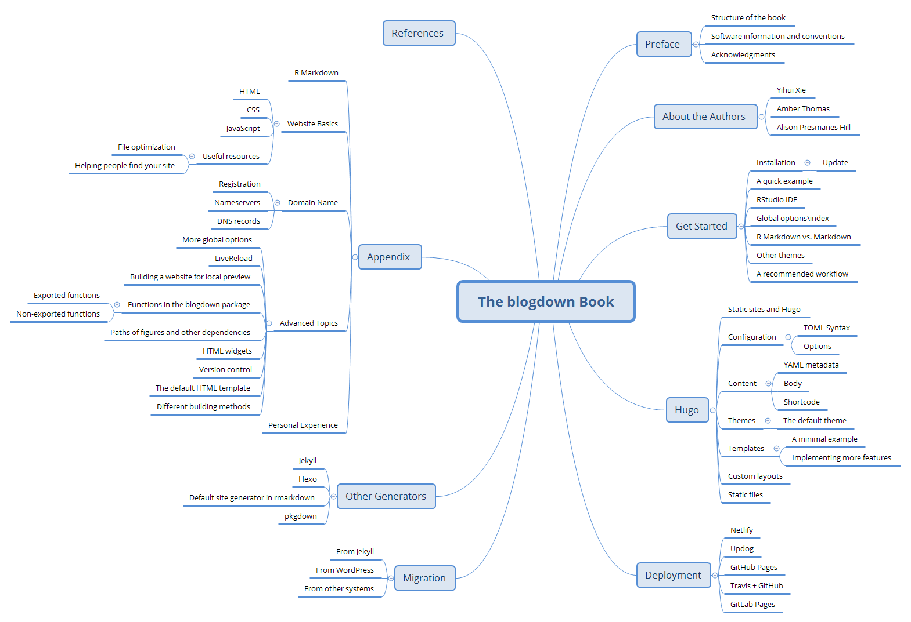](img/mindr_the_blogdown_book.png)

---
class: animated, fadeIn

### Growing Pains (Episode 2): hyperlinks
.pull-left[
[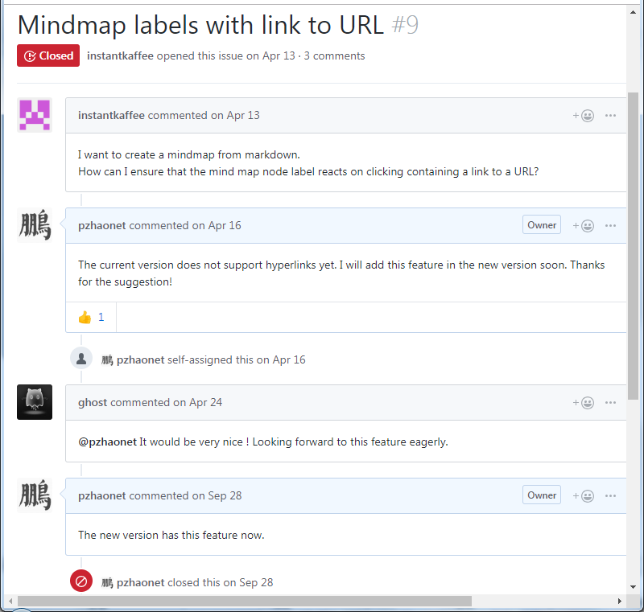](img/hyperlink-request.png)
]
--
.pull-right[

```
# Introduction {#introduction}
## What is 'bookdown' {#what_is__bookdown_}
## What is ['bookdownplus'](https://github.com/pzhaonet/bookdownplus) #<<
## Why 'bookdownplus' {#why__bookdownplus_}
## Giants' Shoulders {#giants__shoulders}
# Quick Start {#quick_start}
## Preparation {#preparation}
## Installation of 'bookdownplus' {#installation_of__bookdownplus_}
## How to use {#how_to_use}
## More output formats
## More templates
## A magic trick
## Recommendations
```

[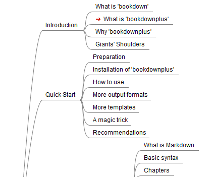](img/mindr-links.png)
]

---
class: animated, fadeIn

### Growing Pains (Episode 3): equations

.pull-left[
```
## More output formats
$$f(k) = {n \choose k} p^{k} (1-p)^{n-k}$$

## More templates
## A magic trick
$$\begin{array}{ccc}
x_{11} & x_{12} & x_{13}\\
x_{21} & x_{22} & x_{23}
\end{array}$$

## Recommendations
```
]

.pull-right[

]

- docear

---
class: animated, fadeIn

## The story of r2rmd()

### Home-made cheatsheet for ggplot2

.pull-left[
```r
# 语法模板 --------
## 简化版 --------
### 数据 + 几何对象 --------
### ggplot(data) + geom_xxx(mapping = aes()) --------
## 完整版 --------
### 数据  + 几何对象(属性映射 + 统计转换 + 位置调整) + 坐标系 + 块面结构 --------
### ggplot(data) + geom_xxx(mapping = aes(),  stat, positon) + coordinate_xxx() + facet_xxx() --------

#附加变量 --------
ggplot(data = da) +
  geom_point(mapping = aes(x = GDP, y = car, color = region))
# 块面结构 --------

## facet_wrap() --------
```
]

.pull-right[
[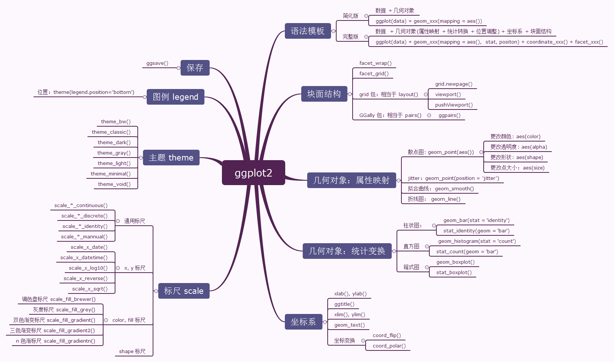](img/ggplot2.png)
]

---
class: animated, fadeIn

### How to write comments

.pull-left[
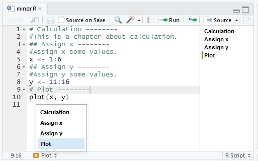
--

`r2md()`

]

--
.pull-right[

````markdown
# Calculation
This is a chapter about calculation.
## Assign x
Assign x some values.
```{r}
x <- 1:6
```
## Assign y
Assign y some values.
```{r}
y <- 11:16
```
# Plot
```{r}
plot(x, y)
```
````
]


---
class: animated, fadeIn


### Feedback came once again...
.pull-left[

]
--
.pull-right[
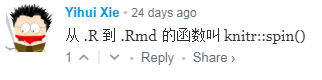
]

---
class: middle, center

### Write .R with markdown: Rules


| No. | \.R script                   |  \.Rmd document             |
| --- | ------------------------------ | ---------------------------------------- |
| 1 | comment beginning with "`#' `"       | text                             |
--

| 2 | comment beginning with "`#+ `"  | chunk options |
--

| 3 | "`{{}}`" (e.g. "`{{mean(x)}}`") | inline code (e.g. "`r knitr::inline_expr('mean(x)')`") |
--

| 4 | code line                    | code block |
--

| 5 | comment beginning with "`# `" |  comment in the code block |
--

| 6 | between "`# /*`" and "`# */`"   | skip. not into .Rmd |
--

| 7 |  .red[comment beginning with "`#= `"]  | headings         |


---
class: animated, fadeIn


### Write .R with markdown: Codes

.pull-left[

```r
#= ## A Simple Example ----
#' The report begins here.

#+ test-a, cache=FALSE
# boring examples as usual
set.seed(123)
x = rnorm(5)
mean(x)

```

]

.pull-right[

````markdown
## A Simple Example 
The report begins here.

```{r test-a, cache=FALSE}
# boring examples as usual
set.seed(123)
x = rnorm(5)
mean(x)
```
````

]

.center[
$$\text{.R}\rightleftharpoons\text{.Rmd}$$

`knitr::spin()` and  `knitr::purl()`

`mindr::r2rmd()` and `mindr::rmd2r()`
]
---

class: center, middle, animated, fadeIn


# Usages

---

class: animated, rotateIn

background-image: url(https://github.com/pzhaonet/mindr/raw/master/showcase/mindr_concept_1.1.8.png)

## Concept

---
class: animated, fadeIn

## Installation

.pull-left[
- R
- mindr
- freemind
]

.pull-right[
- RStudio *
- xmind *
- docear *
]

```{r, eval=FALSE}
# from CRAN (stable)
install.packages('mindr')
# from github (development)
install.packages('devtools')
devtools::install_github('pzhaonet/mindr')
# load
library('mindr)
```

.footnote[
\* Recommended
]

---
class: animated, fadeIn


## Citation

```{r}
citation('mindr')
```

---
class: animated, fadeIn


## Main functions
.pull-left[
```r
md2mm()
mm2r()
r2rmd()
```
]
.pull-right[
```r
mm2md()
r2mm()
rmd2r()
```
]

```r
example(function_name)
mm()
```

--

## More...

```r
example(markmap)
```

```r
dir2()
outline()
tree2mm()
```

--

```r
mindr::<tab>
```

---
background-image: url(img/end.jpg)
class: inverse, right, bottom, animated, slideInRight

# More features are coming soon...

---
class: animated, bounceIn

background-image: url(https://upload.wikimedia.org/wikipedia/commons/b/be/Sharingan_triple.svg)
background-size: 100px
background-position: 95% 5%


# Acknowledgements

## [**xaringan**](https://github.com/yihui/xaringan) `r ct('R-xaringan')` 

```{r, warning=FALSE}
citation('xaringan')
```

class: animated, slideOutLeft

---
background-image: url(https://upload.wikimedia.org/wikipedia/commons/b/be/Sharingan_triple.svg)
background-size: 100px
background-position: 95% 5%
class: center, bottom, animated, bounceIn


.left-column[
## Gratis: cheatsheet for xaringan slides
]

.small[
```{r, echo=FALSE}
knitr::kable(read.csv('tbl/mindr-xaringan-tips.csv'), format = 'html')
```
]

???

- insert symbols: <https://www.toptal.com/designers/htmlarrows/>
- themes: 
  - showcase: <https://github.com/yihui/xaringan/wiki/Themes>
  - package: xaringanthemer <https://pkg.garrickadenbuie.com/xaringanthemer/articles/xaringanthemer.html>
- animation: <https://github.com/yihui/xaringan/issues/184>
- ppt to xaringan:
```r
devtools::install_github("datalorax/slidex")
library(slidex)
pptx <- system.file("examples", "slidedemo.pptx", package = "slidex")
convert_pptx(path = pptx, author = "Daniel Anderson")
```
- convert to pdf:
```r
install.packages("webshot")
library(webshot)
install_phantomjs()
file_name <- paste0("file://", normalizePath("my_xaringan.html"))
webshot(file_name, "mypdf.pdf")
```
- citation
```r
library(RefManageR)
BibOptions(check.entries = FALSE, 
           bib.style = "authoryear", 
           cite.style = 'alphabetic', 
           style = "markdown",
           hyperlink = FALSE, 
           dashed = FALSE)
myBib <- ReadBib("./myBib.bib", check = FALSE)
Citet()
Citep()
AutoCite()
PrintBibliography(myBib)
```

- small font size of a table
  - `.small[the plain markdown syntax for a table]`
  - `<div style="font-size: tiny">` `</div>`
  - `.small[`knitr::kable`]`


---
class:center, animated, bounceIn


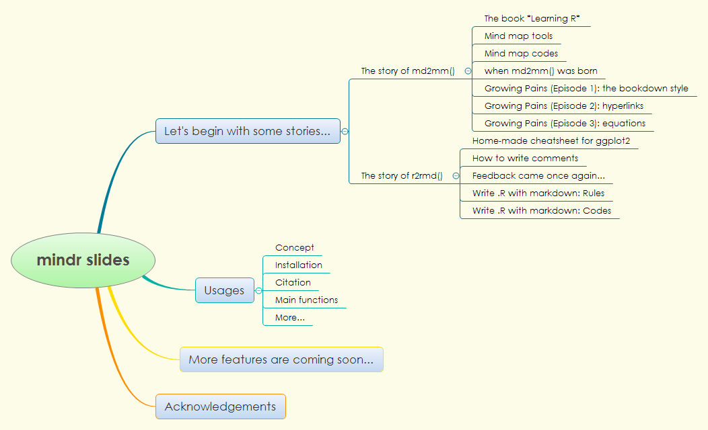

```r
mindr::md2mm()
```

# References

.left[

```{r, 'ref', results='asis', echo=FALSE}
PrintBibliography(myBib)
```
]
